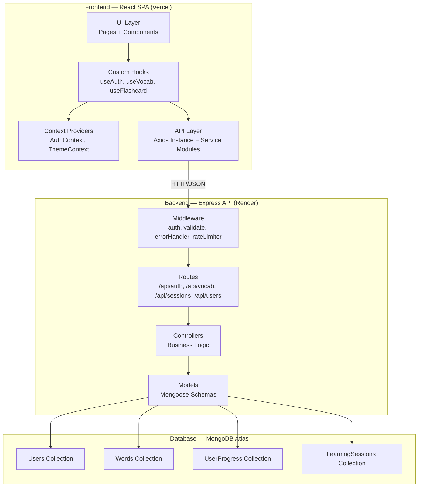
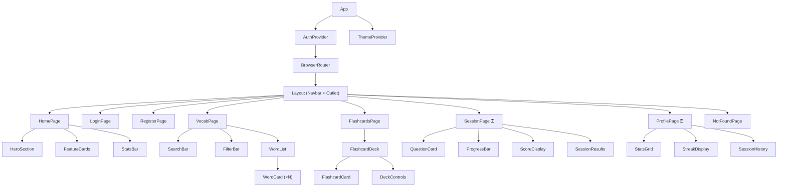
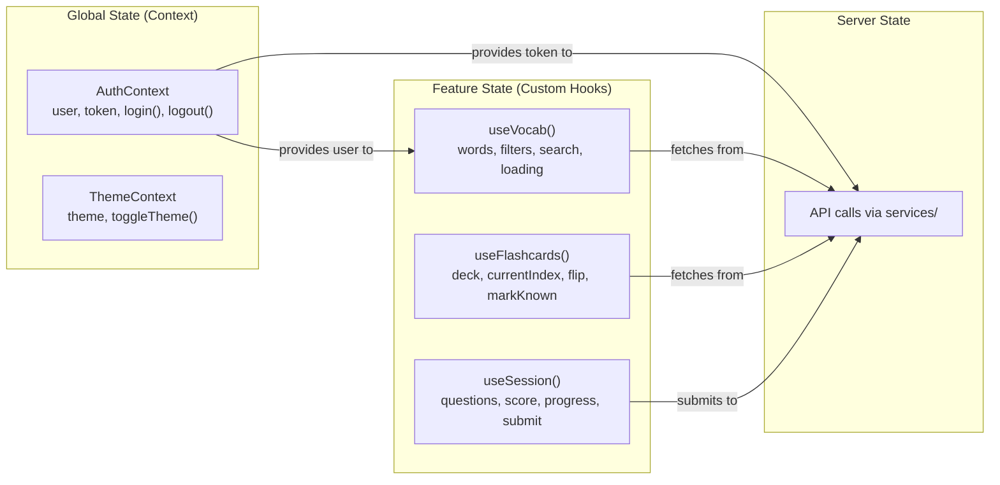

# DeutschPixel — German Vocabulary Trainer

A Duolingo-inspired full-stack web application for learning German vocabulary, built with React + Express + MongoDB.

> [!IMPORTANT]
> **Review this entire plan carefully before approving.** Once approved, we execute phase-by-phase. Every architectural decision below is intentional — if you disagree with anything, now is the time to discuss.

---

## 1. Architecture Diagram



### Why this architecture?

| Decision | Rationale |
|---|---|
| **MVC on backend** | Industry standard, easy to explain in interviews, clean separation of concerns |
| **Custom Hooks on frontend** | Shows React proficiency beyond tutorials — recruiters look for this |
| **Context API (not Redux)** | For this app's scale, Redux is over-engineering. Context + useReducer is the right call |
| **Service layer (Axios)** | Centralized API calls = single place to handle tokens, errors, base URLs |
| **Middleware chain** | Demonstrates understanding of Express patterns — auth, validation, error handling |

---

## 2. Folder Structure

```
DeutschPixel/
├── client/                          # React frontend
│   ├── public/
│   │   └── index.html
│   ├── src/
│   │   ├── assets/                  # Static assets (icons, images)
│   │   ├── components/              # Reusable UI components
│   │   │   ├── common/              # Button, Input, Card, Modal, Loader
│   │   │   ├── layout/              # Navbar, Sidebar, Footer, PageWrapper
│   │   │   ├── auth/                # LoginForm, RegisterForm
│   │   │   ├── vocab/               # WordCard, WordList, SearchBar, FilterBar
│   │   │   ├── flashcard/           # FlashcardDeck, FlashcardCard
│   │   │   └── session/             # QuestionCard, ProgressBar, ScoreDisplay
│   │   ├── contexts/                # React Context providers
│   │   │   ├── AuthContext.jsx
│   │   │   └── ThemeContext.jsx
│   │   ├── hooks/                   # Custom React hooks
│   │   │   ├── useAuth.js
│   │   │   ├── useVocab.js
│   │   │   ├── useFlashcards.js
│   │   │   └── useSession.js
│   │   ├── pages/                   # Route-level page components
│   │   │   ├── HomePage.jsx
│   │   │   ├── LoginPage.jsx
│   │   │   ├── RegisterPage.jsx
│   │   │   ├── VocabPage.jsx
│   │   │   ├── FlashcardsPage.jsx
│   │   │   ├── SessionPage.jsx
│   │   │   ├── ProfilePage.jsx
│   │   │   └── NotFoundPage.jsx
│   │   ├── services/                # API service modules
│   │   │   ├── api.js               # Axios instance + interceptors
│   │   │   ├── authService.js
│   │   │   ├── vocabService.js
│   │   │   ├── sessionService.js
│   │   │   └── userService.js
│   │   ├── styles/                  # Global + component CSS
│   │   │   ├── variables.css        # CSS custom properties (design tokens)
│   │   │   ├── global.css           # Reset + base styles
│   │   │   ├── components/          # Per-component CSS modules
│   │   │   └── pages/               # Per-page CSS
│   │   ├── utils/                   # Helpers (formatDate, calculateXP, etc.)
│   │   ├── App.jsx
│   │   ├── App.css
│   │   └── main.jsx
│   ├── .env
│   ├── package.json
│   └── vite.config.js
│
├── server/                          # Express backend
│   ├── config/
│   │   └── db.js                    # MongoDB connection
│   ├── controllers/
│   │   ├── authController.js
│   │   ├── vocabController.js
│   │   ├── sessionController.js
│   │   └── userController.js
│   ├── middleware/
│   │   ├── auth.js                  # JWT verification
│   │   ├── validate.js              # Request validation
│   │   └── errorHandler.js          # Centralized error handler
│   ├── models/
│   │   ├── User.js
│   │   ├── Word.js
│   │   ├── UserProgress.js
│   │   └── LearningSession.js
│   ├── routes/
│   │   ├── authRoutes.js
│   │   ├── vocabRoutes.js
│   │   ├── sessionRoutes.js
│   │   └── userRoutes.js
│   ├── seeds/
│   │   └── wordSeed.js              # Initial vocabulary data
│   ├── utils/
│   │   └── helpers.js
│   ├── .env
│   ├── server.js                    # Entry point
│   └── package.json
│
├── .gitignore
├── README.md
└── ARCHITECTURE.md
```

### Naming Conventions

| Element | Convention | Example |
|---|---|---|
| Folders | `camelCase` | `components/`, `flashcard/` |
| React Components | `PascalCase.jsx` | `WordCard.jsx`, `LoginPage.jsx` |
| Hooks | `camelCase` starting with `use` | `useAuth.js`, `useVocab.js` |
| Services | `camelCase` + `Service` | `authService.js` |
| Backend files | `camelCase` | `authController.js` |
| CSS files | Match component name | `WordCard.css` |
| Env variables | `SCREAMING_SNAKE_CASE` | `MONGODB_URI`, `JWT_SECRET` |

---

## 3. Database Schema

### Users Collection

```javascript
{
  _id: ObjectId,
  username: String,        // Display name, unique — shown on profile & leaderboard
  email: String,           // Unique, used for login
  password: String,        // bcrypt hashed — NEVER stored in plain text
  xp: Number,             // Total experience points — gamification metric
  streak: Number,          // Consecutive days of practice — motivational metric
  lastActiveDate: Date,    // Used to calculate streak continuity
  wordsLearned: Number,    // Counter for profile stats (denormalized for speed)
  createdAt: Date,         // Auto via timestamps
  updatedAt: Date          // Auto via timestamps
}
// INDEX: { email: 1 } — unique, used for login lookups
// INDEX: { xp: -1 } — for leaderboard sorting
```

**Why denormalize `wordsLearned` and `xp`?** Counting from UserProgress on every profile load is expensive. We update these counters atomically when progress changes. This is a real-world trade-off recruiters understand.

### Words Collection

```javascript
{
  _id: ObjectId,
  german: String,          // The German word — "Hund"
  english: String,         // English translation — "Dog"
  article: String,         // "der", "die", "das" — critical for German nouns
  category: String,        // "animals", "food", "greetings", etc. — for filtering
  difficulty: String,      // "beginner", "intermediate", "advanced" — for filtering
  exampleSentence: String, // "Der Hund ist groß." — adds learning context
  plural: String,          // "Hunde" — German plurals are irregular, important to learn
  partOfSpeech: String     // "noun", "verb", "adjective" — for grammar awareness
}
// INDEX: { category: 1, difficulty: 1 } — compound index for filtered queries
// INDEX: { german: "text", english: "text" } — text index for search
```

**Why no user reference?** Words are shared, global data. Every user sees the same word list. User-specific data lives in UserProgress.

### UserProgress Collection

```javascript
{
  _id: ObjectId,
  userId: ObjectId,        // ref: User — who is learning
  wordId: ObjectId,        // ref: Word — which word
  status: String,          // "learning", "known", "needs_practice" — flashcard state
  correctCount: Number,    // Times answered correctly — feeds accuracy calculation
  incorrectCount: Number,  // Times answered wrong — used to resurface hard words
  lastReviewed: Date,      // When they last saw this word — for spaced repetition later
  bookmarked: Boolean      // User-saved for later review (bonus feature)
}
// INDEX: { userId: 1, wordId: 1 } — unique compound, prevents duplicate progress entries
// INDEX: { userId: 1, status: 1 } — fast lookup for "show me words I'm learning"
```

**Why a separate collection?** This is a many-to-many relationship (many users × many words). Embedding progress inside User would bloat the document. This is the MongoDB equivalent of a join table.

### LearningSessions Collection

```javascript
{
  _id: ObjectId,
  userId: ObjectId,        // ref: User — who took the session
  totalQuestions: Number,  // How many questions in this session
  correctAnswers: Number,  // How many they got right
  xpEarned: Number,       // XP awarded — calculated server-side (10 per correct)
  accuracy: Number,        // Percentage — pre-calculated for quick display
  duration: Number,        // Seconds — shows engagement time
  completedAt: Date        // When the session ended
}
// INDEX: { userId: 1, completedAt: -1 } — recent sessions first for profile page
```

**Why track sessions separately?** This gives us a history timeline. Users can see "I did 3 sessions today, averaging 80% accuracy." Recruiters see you understand analytics data modeling.

---

## 4. API Endpoints

### Auth (`/api/auth`)

| Method | Endpoint | Description | Auth? | Request Body |
|---|---|---|---|---|
| `POST` | `/api/auth/register` | Create new user | No | `{ username, email, password }` |
| `POST` | `/api/auth/login` | Login, return JWT | No | `{ email, password }` |
| `GET` | `/api/auth/me` | Get current user | Yes | — |

### Vocabulary (`/api/vocab`)

| Method | Endpoint | Description | Auth? | Query Params |
|---|---|---|---|---|
| `GET` | `/api/vocab` | Get all words (paginated) | No | `?category=food&difficulty=beginner&search=hund&page=1&limit=20` |
| `GET` | `/api/vocab/random` | Get random word | No | `?count=10` |
| `GET` | `/api/vocab/categories` | List all categories | No | — |
| `GET` | `/api/vocab/:id` | Get single word | No | — |

> [!NOTE]
> Vocab endpoints are public (no auth required). This is intentional — users should browse words before creating an account. It's a conversion funnel strategy.

### User Progress (`/api/progress`)

| Method | Endpoint | Description | Auth? | Request Body |
|---|---|---|---|---|
| `GET` | `/api/progress` | Get user's word progress | Yes | `?status=learning` |
| `PUT` | `/api/progress/:wordId` | Update word status | Yes | `{ status, correct }` |

### Learning Sessions (`/api/sessions`)

| Method | Endpoint | Description | Auth? | Request Body |
|---|---|---|---|---|
| `POST` | `/api/sessions` | Save completed session | Yes | `{ totalQuestions, correctAnswers, duration }` |
| `GET` | `/api/sessions` | Get user's session history | Yes | `?limit=10` |

### User (`/api/users`)

| Method | Endpoint | Description | Auth? |
|---|---|---|---|
| `GET` | `/api/users/profile` | Get full profile + stats | Yes |
| `GET` | `/api/users/leaderboard` | Get top users by XP | No |

### Consistent Response Format

```json
// Success
{ "success": true, "data": { ... } }

// Error
{ "success": false, "error": "Validation failed", "details": [...] }

// Paginated
{ "success": true, "data": [...], "pagination": { "page": 1, "limit": 20, "total": 150 } }
```

---

## 5. Component Hierarchy



`⚿` = Protected route (requires authentication)

### Reusable Common Components

| Component | Used By | Purpose |
|---|---|---|
| `Button` | Everywhere | Consistent button styles with variants (primary, secondary, ghost) |
| `Input` | Auth forms, Search | Styled input with label, error state, icon support |
| `Card` | WordCard, FeatureCards | Consistent card container with hover effects |
| `Modal` | Confirmations, Results | Overlay dialog |
| `Loader` | Any async page | Skeleton/spinner during data fetch |
| `Badge` | Categories, Difficulty | Small colored label |
| `ProgressBar` | Session, Profile | Animated progress indicator |

---

## 6. State Management Strategy



### Why this approach?

| Concern | Solution | Why NOT the alternative? |
|---|---|---|
| Auth state | `AuthContext` + `useReducer` | Redux is overkill for auth-only global state |
| Theme | `ThemeContext` | Simple toggle, no complex logic needed |
| Vocab data | `useVocab` hook with `useState` | Data is page-local, not needed globally |
| Flashcard state | `useFlashcards` hook | Complex local state (index, flip, deck) — perfect for a custom hook |
| Session state | `useSession` hook | Temporary state that resets each session |

---

## 7. Git Branch Strategy

```
main                          ← production-ready, deployed
  └── develop                 ← integration branch
       ├── feature/auth       ← Day 1: authentication system
       ├── feature/vocab      ← Day 2: vocabulary browsing
       ├── feature/flashcards ← Day 2-3: flashcard system
       ├── feature/sessions   ← Day 3: learning sessions
       ├── feature/profile    ← Day 3: user profile
       └── feature/polish     ← Day 4: UI polish, deploy, README
```

### Commit Message Convention

```
type(scope): description

feat(auth): add JWT authentication with refresh token
fix(vocab): correct pagination offset calculation
style(flashcard): add flip animation with 3D transform
docs(readme): add architecture diagram and screenshots
chore(deps): update mongoose to 8.x
```

> [!TIP]
> **Recruiter tip:** Clean, conventional commits show professionalism. When a recruiter clicks your repo, the commit history is one of the first things they scan.

---

## 8. Four-Day Development Schedule

### Day 1 — Foundation + Auth (8 hours)

| Time | Task | Deliverable |
|---|---|---|
| **Hour 1–2** | Project setup: Vite + Express, folder structure, MongoDB Atlas, `.env`, `.gitignore` | Both apps running locally |
| **Hour 2–3** | Design system: `variables.css`, `global.css`, Google Fonts, color palette, CSS custom properties | Design tokens ready |
| **Hour 3–4** | Common components: `Button`, `Input`, `Card`, `Loader`, `Badge` | Reusable component library |
| **Hour 4–5** | Backend auth: User model, register/login controllers, JWT middleware, password hashing | Auth API working in Postman |
| **Hour 5–6** | Frontend auth: `AuthContext`, `LoginPage`, `RegisterPage`, protected route wrapper | Login/register flow working |
| **Hour 6–7** | Navbar + Layout: responsive nav with user state, mobile hamburger menu | Navigation working |
| **Hour 7–8** | Homepage: hero section, feature cards, call-to-action | Landing page done |
| **Commit** | `feat: complete authentication system with JWT and responsive layout` | |

### Day 2 — Vocabulary + Flashcards (8 hours)

| Time | Task | Deliverable |
|---|---|---|
| **Hour 1–2** | Word model + seed data: 80–100 German words across 6 categories | Database populated |
| **Hour 2–3** | Vocab API: CRUD endpoints, search, filter, pagination | API tested in Postman |
| **Hour 3–4** | Vocab page UI: `WordList`, `WordCard`, `SearchBar`, `FilterBar` | Browse page working |
| **Hour 4–5** | `useVocab` hook: debounced search, filter state, pagination | Clean data flow |
| **Hour 5–6** | Flashcard backend: `UserProgress` model, progress endpoints | Progress tracking API |
| **Hour 6–7** | Flashcard UI: `FlashcardCard` with 3D flip, `FlashcardDeck` with navigation | Flashcard core working |
| **Hour 7–8** | Flashcard features: mark known/needs practice, deck filtering | Full flashcard flow |
| **Commit** | `feat: add vocabulary browsing with search/filter and flashcard system` | |

### Day 3 — Learning Sessions + Profile (8 hours)

| Time | Task | Deliverable |
|---|---|---|
| **Hour 1–2** | Session backend: random question generation, score calculation, XP system | Session API working |
| **Hour 2–3** | Session UI: `QuestionCard`, `ProgressBar`, answer selection | Quiz flow working |
| **Hour 3–4** | Session results: score display, XP animation, session history save | Complete session loop |
| **Hour 4–5** | Profile backend: aggregate stats, session history, streak calculation | Profile API working |
| **Hour 5–6** | Profile UI: stats grid, streak display, session history list | Profile page done |
| **Hour 6–7** | Dark mode: `ThemeContext`, CSS custom properties swap, toggle in navbar | Theme switching works |
| **Hour 7–8** | Error handling: loading states, error boundaries, empty states, 404 page | Robust UX |
| **Commit** | `feat: add learning sessions, user profile, and dark mode` | |

### Day 4 — Polish + Deploy + README (8 hours)

| Time | Task | Deliverable |
|---|---|---|
| **Hour 1–2** | Responsive pass: test every page on mobile/tablet, fix breakpoints | Fully responsive |
| **Hour 2–3** | Animation polish: page transitions, micro-interactions, hover effects | Premium feel |
| **Hour 3–4** | Deploy frontend to Vercel, backend to Render, test production | Live application |
| **Hour 4–5** | README: badges, screenshots, architecture diagram, setup instructions | Professional README |
| **Hour 5–6** | API documentation: endpoint table, example requests/responses | API docs done |
| **Hour 6–7** | Leaderboard (bonus): simple top-10 by XP, add to homepage | Social feature |
| **Hour 7–8** | Final testing, bug fixes, screenshot capture, resume bullet points | Ship it 🚀 |
| **Commit** | `docs: add README, API docs, and architecture diagram` | |

---

## 9. Feature Prioritization

### ✅ Must Have (MVP)

| Feature | Resume Impact | Complexity | Day |
|---|---|---|---|
| JWT Authentication (register/login/logout) | ★★★★★ | Medium | 1 |
| Protected Routes | ★★★★☆ | Low | 1 |
| Vocabulary Browse with Search + Filter | ★★★★★ | Medium | 2 |
| Flashcards with Flip Animation | ★★★★★ | Medium | 2 |
| Learning Session with Score + XP | ★★★★★ | High | 3 |
| User Profile with Stats | ★★★★☆ | Medium | 3 |
| Responsive Design | ★★★★★ | Medium | 4 |
| Professional README | ★★★★★ | Low | 4 |
| Deployment | ★★★★★ | Low | 4 |

### 🟡 Nice to Have

| Feature | Resume Impact | Complexity | When |
|---|---|---|---|
| Dark Mode | ★★★★☆ | Low | Day 3 (built into design system) |
| Leaderboard | ★★★☆☆ | Low | Day 4 spare time |
| Animations/Micro-interactions | ★★★★☆ | Low | Day 4 polish |
| Bookmarks | ★★☆☆☆ | Low | Day 4 if time |

### ❌ Skip for MVP

| Feature | Why Skip |
|---|---|
| Typing Mode | Complex input validation in German, not worth the time |
| Achievements System | Requires complex state machine, high effort for low visual impact |
| Daily Goal | Needs notification system, over-engineering for portfolio |
| Spaced Repetition Algorithm | Impressive but time-consuming to implement correctly |
| Social Features | Login with Google, friend system — scope creep |

---

## 10. Resume Bullet Points (Preview)

These are what you'll be able to say after Day 4:

> - Built a full-stack German vocabulary trainer with React, Express, and MongoDB, featuring JWT authentication, flashcard learning, and gamified quiz sessions
> - Designed RESTful API with 12+ endpoints, input validation, centralized error handling, and consistent JSON response format
> - Implemented custom React hooks and Context API for clean state management, achieving zero prop drilling across 8+ page components
> - Created a responsive, dark-mode-enabled UI with CSS custom properties, 3D flashcard animations, and mobile-first design principles
> - Deployed to Vercel (frontend) and Render (backend) with MongoDB Atlas, achieving production-ready CI/CD pipeline

---

## Decisions (Resolved)

| Question | Decision |
|---|---|
| MongoDB Atlas | ✅ User has account ready |
| Seed Data | ✅ User will provide words. System must support easy additions via seed script |
| Quiz Format | ✅ **3 modes** — see below |
| Color Palette | ✅ Green primary + navy/charcoal dark theme approved |
| Project Name | ✅ **DeutschPixel** |

### Quiz Format (3 Modes)

| Mode | Prompt | Answer Type | Details |
|---|---|---|---|
| **Article Quiz** | Show German noun | MCQ: `der` / `die` / `das` | 3 fixed options, great for article drilling |
| **English → German** | Show English word | Type German word | Tests recall + spelling |
| **German → English** | Show German word | Type English word | Tests comprehension |

---

## Proposed Changes (Execution Preview)

Once you approve this plan, we'll execute in this order:

### Phase 1 — Project Scaffolding (Day 1, Hours 1–2)
#### [NEW] `client/` — Vite React app
#### [NEW] `server/` — Express API
#### [NEW] `.gitignore`, `README.md`

### Phase 2 — Design System (Day 1, Hours 2–3)
#### [NEW] `client/src/styles/variables.css`
#### [NEW] `client/src/styles/global.css`

### Phase 3 — Common Components (Day 1, Hours 3–4)
#### [NEW] `client/src/components/common/Button.jsx` + CSS
#### [NEW] `client/src/components/common/Input.jsx` + CSS
#### [NEW] `client/src/components/common/Card.jsx` + CSS

### Phase 4 — Authentication (Day 1, Hours 4–7)
#### [NEW] `server/models/User.js`
#### [NEW] `server/controllers/authController.js`
#### [NEW] `server/middleware/auth.js`
#### [NEW] `client/src/contexts/AuthContext.jsx`
#### [NEW] `client/src/pages/LoginPage.jsx`
#### [NEW] `client/src/pages/RegisterPage.jsx`

*...and so on through Day 4.*

## Verification Plan

### After Each Phase
- Backend: Test every endpoint with `curl` or browser
- Frontend: Visual verification in browser at each breakpoint (mobile, tablet, desktop)
- Integration: Full user flow test (register → login → browse → flashcard → session → profile)

### Final Verification (Day 4)
- Production deployment smoke test
- Responsive check on 3 viewport sizes
- All API endpoints return correct status codes
- Auth flow works end-to-end in production
